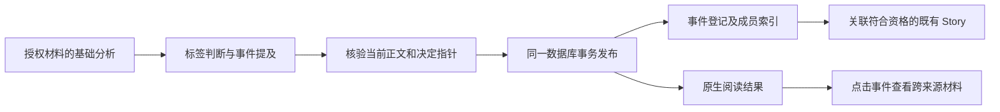

# 事件登记与同事件检索：第二阶段实现

本阶段在已有单篇语义分析、规则和阅读器中加入事件登记。文章可以直接打开事件，跨来源查看报道、分析、教程和次要提及；只有一篇材料时也有事件，不要求先生成 Story。

## 身份、提及与证据

- 系统生成稳定 `evt_<UUID>`，显示标题及别名独立保存。文章标题、标签或主题相近不能单独建立同事件关系。
- 身份沿用主体、动作、对象、版本、轮次、发生锚点及原文证据。分析和教程可以引用其讨论的真实事件，成员角色分别为 `reports / analysis_of / tutorial_for / mentions`。
- 新语义请求最多返回四个 `eventMentions`，主事件最多一个；旧 `event` 必须与显式主提及逐字段一致。多事件周报也可以没有主事件。
- 模型只选择当前证据目录的编号；落盘时恢复原始连续片段。主体、对象、版本、轮次和日期时间需由各自证据支持。官方链接必须能在当前原文、来源地址或已完成的链接材料中核对。
- 自动登记区分 `candidate / confirmed`。证据不足或有多个兼容候选时保留候选；已知不同版本、轮次、发生区间或官方引用不会自动并入同一事件。匹配同时核对事件身份与每个当前已确认成员，避免缺失版本的材料把两个版本串到一起。
- `confirmed` 表示归属满足当前证据门槛，不表示所有来源观点或事实都已被系统证实。翻译后的标题可作别名；实体别名或跨语言名称没有原文证据时不自行猜测。

长文逐块独立保留事件身份引用，最终恢复同一目录的原始证据；这些引用不受 `facts` 数量上限影响。语义输出分别保存 `materialCoverage` 与 `semanticAssessmentCoverage`，原文不完整和标签未知不混用；旧 `coverage` 仅作兼容。特殊摘要变换保留基础事件和提及，不能通过修改摘要改变归属。

## 发布与旧数据

事件表、成员表、发布标记、纠错日志和查询快照使用现有账号 SQLite 数据库。登记只接受已成功发布的当前正文、代际、规则版和不可变决定指针。同一决定重发不重新登记，也不接受调用者伪造的正文或来源。

旧格式 4 与没有 `eventMentions` 的缓存继续可读，以旧 `event` 映射单个提及。事件入口和 worker 可按需登记已有的当前已完成决定，不补抓来源、不重新调用模型。缺失或不可核验的身份维持未知或候选。当前提取契约使用 `ENTRY_PROMPT_VERSION=14`、`semantic-entry-v3` 与 `semantic-chunks-v4`；缓存版本变化只作用于后续授权处理，不启动历史重跑。

## 检索与阅读

从现有 AI 结果面板点击事件，在同一面板按角色和确认状态查看成员、原文及证据。分析和教程明确显示为独立文章。事件关联的已有 Story 复用 `StoryDigestPanel` 阅读；没有综述时显示成员，不创建空综述。

成员和事件列表使用冻结快照。先排除不可访问来源、撤回材料及当前隐藏的噪声，再计数、排序和分页；人工恢复按当前展示覆盖计算。成员默认不包含人工移出的提及。快照绑定账号、筛选、来源范围及当前登记修订，范围或修订变化返回冲突；切换筛选不能沿用旧快照。最多保留 100 份，24 小时失效。

文章入口核验 `inputSeq / contentVersion / decisionId`，前端请求切换或正文更新会丢弃陈旧结果。来源地址只开放普通 HTTP(S) 原文链接。

## 人工纠错与 Story

支持事件改名、移出指定提及、移动到其他事件、合并、拆分和撤销。关系纠错保存人工记录，绑定来源、文章及正文版本；同正文重算不能凭模型再次复活已移出、移动或拆开的关系。已有人工关系的正文出现新的身份字段组合时，只登记独立候选，不自动重新归组。每个操作核验相关事件修订与请求 ID。重放相同请求返回原结果且不重复失效 Story；事务副作用失败时整个纠错回滚。

改名只改变事件展示，不修改文章、Story 正文、已读或收藏。关系变化使受影响的已有 Story 等待修复，并重建当前事件关联，不在纠错请求中调用模型或合成 Story。撤销核验所有受影响事件的修订和成员的当前正文/决定指针，不覆盖后来的变更。合并和拆分保留原事件 ID 的后继去向。

事件 ID 与 Story ID 独立。既有 Story 的 ID、版本、深链、读态和收藏保持原机制；当前修订的事件关联是可重建投影。单篇事件、独立分析和教程不强制成为 Story。

`facts` 可保存 `eventMentionIndex?: number | null`，数值 0–3 只引用同一不可变决定内 `eventMentions` 的有序数组。原始证据必须完整支持所选提及，且不能与其他事件片段重叠；越界、错序、重复摘引或混写片段拒绝归属。`null` 明确表示未归属；省略时仅沿用旧主事件证据保护，不自动分给次事件。分块事实不携带局部序号，长文综合重新绑定最终数组顺序，摘要变换不能修改基础提及身份。

并列周报可以没有主事件，通过有据的逐事实归属分别贡献给多个已确认事件。Story 成员可保存相同的 `eventMentionIndex`；生成和持久化发布都核验当前决定指针、登记关系和该片段事实许可。`reports / analysis_of / tutorial_for` 需满足对应确认与证据门槛，背景 `mentions`、未知关系、人工移出及不同身份不能获得事件综述资格。分析、教程和多事件文章仍保留独立原文入口，片段进入某篇 Story 不表示全篇已被覆盖。

稳定事件 ID 约束模型请求前的候选分组和已有 Story 召回，不让人工拆分的同名身份重新进入一次综合请求。按主题综合的现有模式继续按其原有规则执行。

## 接口

路径相对 `/information/v1`：

| 接口                                      | 行为                                                                   |
| ----------------------------------------- | ---------------------------------------------------------------------- |
| `GET /processing/entries/:seq/events`     | 当前正文/决定指针、事件及各提及                                        |
| `GET /processing/events/:id`              | 身份、别名、修订、当前范围成员数、后继、已有 Story                     |
| `POST /processing/events`                 | `search / snapshotId / offset / limit`，按标题及别名冻结分页           |
| `POST /processing/events/:id/members`     | `role / state / order / snapshotId / offset / limit`，先过滤再冻结分页 |
| `POST /processing/events/:id/corrections` | `requestId / expectedRevisions / action`，事务纠错与幂等回放           |

纠错动作：

| `action.type` | 其他字段                                                            |
| ------------- | ------------------------------------------------------------------- |
| `rename`      | `title`                                                             |
| `exclude`     | `inputSeq, mentionId`                                               |
| `move`        | `inputSeq, mentionId, targetEventId`                                |
| `merge`       | `targetEventId`，当前路径事件并入目标                               |
| `split`       | `groups: [{ title, members: [{ inputSeq, mentionId }] }]`，至少两组 |
| `undo`        | `correctionId`                                                      |

`expectedRevisions` 包含全部受影响事件；移动和合并需源与目标，撤销需原操作涉及的全部事件。陈旧修订返回 HTTP 409，不可访问或无效目标返回 404，缺少账号返回 403。检索不会扩大来源授权范围。

## 验证与下一阶段

采用假模型和实 SQLite 验证基础分析到发布和阅读 API 的完整链路，包括单篇、主次提及、原文证据恢复、分析独立关联、不同版本隔离、人工纠错、重试幂等、事务回滚、陈旧撤销、快照失效和已有 Story 状态保护。前端测试覆盖事件入口、筛选、分页、陈旧响应、纠错预览与版本冲突。

阶段三的事件/实体候选召回、语义去重及 Story 增量差异更新见[增量综述实现说明](./information-story-increments.md)；当前已提供上述有界逐事实归属，不代表任意事件关系或全文语义归属均可自动确认。本文记录源码与本地验证，不证明已部署、已启用真实账号规则或已完成真实模型验收，不启动历史重跑。
